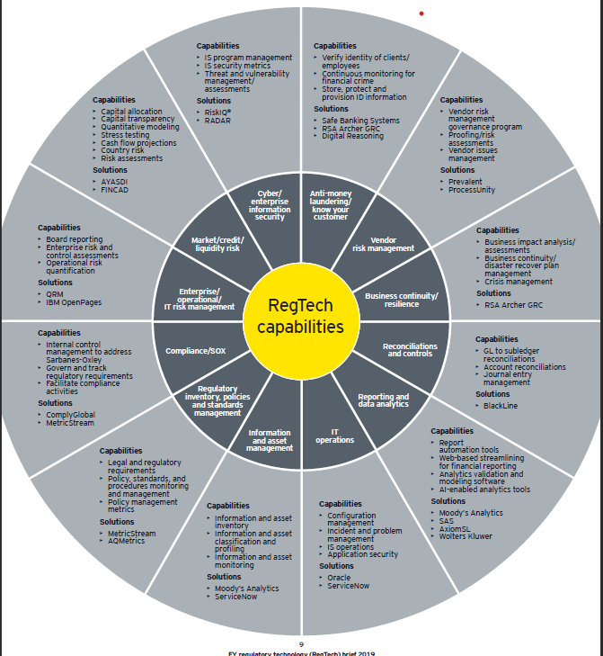
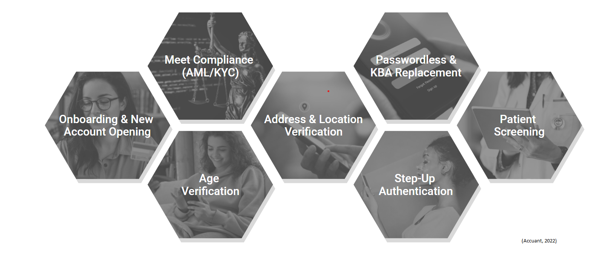
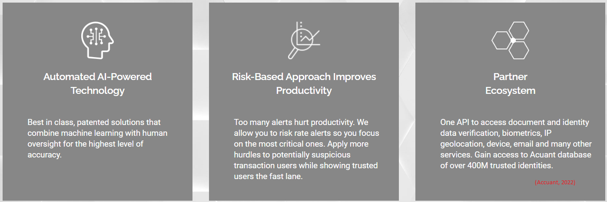
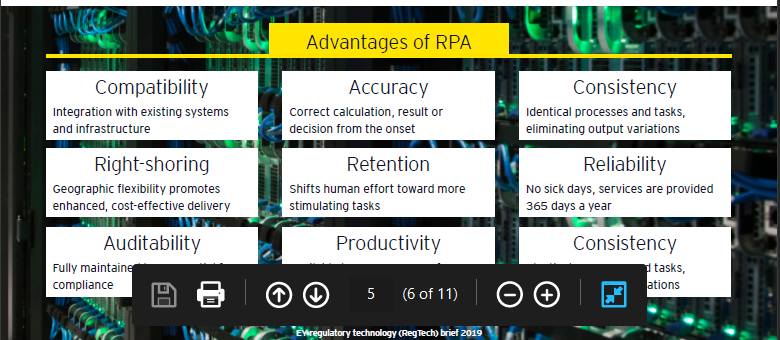

# IdentityMind Global

## Overview and Origin
2008 financial crisis demonstrated the importance of tougher financial regulations to eliminate future risks of financial system collapse. Due to multiple conflicts and social unrest, the need to know who the person is and who owns the money is more important than ever. Lack of trust in traditional financial system has given rise to decentralised ledger-based Bitcoin and other crypto currencies. In addition to that, rising terrorism related financing activities have motivated government and regulators around the globe to build a robust risk management system to eliminate any future misuse of funds. Following the developments in blockchain and crypto technologies there was a bigger push to call for more data privacy, usage and distribution along with anti-money laundering (AML) and Know Your Customer (KYC) Know Your Business (KYB). By identifying the people involved in transactions, a large chunk of risk can be mitigated. This domain of FinTech is widely known as RegTech.

 
RegTech is an emerging field and is composed of two words regulatory and technology. RegTech intends to streamline regulations and compliance in today's changing fintech landscape. RegTech companies automate decision making by supplying organisations with tools to drive efficiency and sustainability in their regulatory compliance function and risk mitigation (Ernst & Young,2019). RegTech is a broad domain and it enables the use of Artificial Intelligence (AI), Big Data, Machine Learning (ML), Blockchain, Biometrics and cloud computing to provide information to companies to tackle issues such as money laundering, identity theft and political power abuse via Know Your Customer (KYC), Know Your Business (KYB), digital identity and similar frameworks. Companies then reduce the strain on compliance and risk management ("What You Should Know About RegTech", 2022) by swiftly accessing data on as needed basis. As a result, AI enablement will increase annual gross cost savings to upward of 700 million by 2023 (Implied Clarity, 2019).

## Company Profile
IdentityMind Global is a Software as a Service (SaaS) provider that uses a patented eDNA® technology to securely track the entities involved in each transaction to build a unique digital identity and trust reputations (Accuant, 2018). The company aims to create a fair and honest marketplace by continuously building, validating and risk scoring digital identity through eDNA® technology (Crosstech, 2022). The company headquarters is in Palo Alto, California and was founded in 2009. The company got incorporated in 2019 (Bloomberg, 2022). The company is now acquired by Acuant a leading global provider of Identity Solutions since 2020 (Finextra Research, 2022). The company was founded by Garrett Gafke and Dan Kolkowitz Kieran Sherlock (Crunchbase Inc, 2022).
The Company was funded in three rounds. Funding round was on May 1, 2013, which raised 3 million USD followed by Series B Funding of 8.5 million USD in December 11 2014 and series C funding of 10 Million USD in January 2018. (Securities.io, 2022)

## Business Activities
IdentityMind is trying to create a fairer marketplace by eliminating potential fraud by having a trust score based digital identity. The company helps financial institutions with the following:
*	Identity Verification
*   KYC/KYB Solutions
*   AML Compliance
*   Sanctions Screening
*  	Transaction Monitoring

The intended customers are traditional financial institutions, Fintech/ money service businesses and digital currency exchanges. As of 2022, the global KYC market is valued at USD 447.53 million and is expected to grow at CAGR of 22.0% to 1964.73 million in 2029 (Polaris Market Research, 2022). The advances in mobile technology and continuously changing regulatory requirements means this is a very conservative.
IdentityMind has registered technology called eDNA® which securely builds, analyses, and verifies digital identities and then associates the individual's known associations through public data (Acuant, 2022). The eDNA algorithm provides trust score and monitors identities for any changes in risk levels by employing AI, ML, BigData and cloud computing. The customers get this data on a subscription basis via their Application Programming Interface (APIs).  
 
The process is a risk-based approach which aims to improve productivity by flagging only the suspicious activities and only where needed a human intervention is applied. The trusted users will have no issues while users or companies with risky attributes will go through further scrutiny. Once the customers risk profile is initiated, this is then periodically reviewed based on updated attributes and any new information. After Acuant acquiring the company, the product is renamed is Acuant Identity (Accuant, 2022). Acuant is a major player in trusted digital identity solutions which has been an industry leading provider for more than 20 years. This gives the company the benefit of having a large footprint in almost 200 countries which the competitors will not have. Furthermore, Acuant identity can utilise other Acuant solutions to further leverage the cause by applying

## Landscape
The company operates in a domain of Trusted Digital Identity such as KYC, KYB and sanctions screening. (Crunchbase Inc, 2022). There have been few developments in legislation in this domain particularly in redefining the due diligence, privacy and information sharing across different jurisdictions. The need to balance the risk to financial institutions and protecting privacy laws has been understood by the stakeholders. Notably in Europe, one of the major directives in AML is AMLD4 which was enforced in 2017 also the enhanced version AMLD5 is effective of January 2020 (Thales, 2022). The aim of AMLD5 is to improve understanding of customers and beneficial owners (BO) of legal intities and their financial dealings to minimise risk (Thales, 2022). This also enforces stricter due diligence (CDD) and control customer identity and share data with central administration (Thales, 2022). EU member states must implement the directive within two years (Thales, 2022). The sixth AML directive was passed in 2018 by European union which must be in effect by financial institutions by 3 June 2021 (ComplyAdvantage, 2022). This directive introduces information sharing between jurisdictions to cater the issue of dual criminality (ComplyAdvantage, 2022) and guilty parties getting away. In terms of technology, the introduction of blockchain and cloud computing along with AI within this space means that a lot of data can be harvested and employed to create a much larger database of trusted digital identities.

There are many companies that provide similar services in identity verification and management such as LifeLock, RiskIQ and AWS Secrets Manager and so on. LifeLock is product by Norton and it has 2694 customers in 58 countries. Lifelock is the leading service provider in identity verification and protection. Lifelock represents a 37.94 percent market share in identity verification and protection. similarly, RiskIQ sits on a second position with 525 customers and this represents 7.39 of total market share. Also, AWS comes third in terms of market share with a 6.72 percent market share. Although IdentityMind is lacking behind all these companies and only represents .31 percent market share, the use of eDNA and ML in identity verification means they are in a prime position to benefit from the changing landscape in identity services and fraud prevention (Slintel, 2022).

## Results

By using the state of art digital DNA technology, IdentityMind has enabled its users to establish complete identity lifecycle management from a single platform. The data can have multiple anchor points which takes into consideration any changes to the legislations, sanctions and association to anyone deemed to have low trust score. Most companies in this domain measure their performance based on the following matrices:
* Customer success metrices.
In this matrix the total number of customers, customer satisfaction, customer retention and general customer demographics are measured to see if the company is successful.
* Marketing matrices
In this matrix, the reach and response rate along with conversion are monitored to quantify and measure the success of a company.
* Financial Matrices
In this matrix, all the financials are taken into consideration such as total gross revenue, net profit, marketing spend and cost per customer.

## Recommendations
It appears that IdentityMind is focusing on institutions and regulators thus they seem to have a small customer base. If they were to focus on individuals and small or medium business, they can easily grow their market share and become more profitable. Furthermore, in the changing landscape post COVID, if Acuant is to deploy an eDNA based approach to track individual's health and well-being, this might be a great opportunity to expand market reach and increase profit. This will not only be beneficial for the individual and the company but healthcare providers can be more efficient since they can get all the information about patients within seconds which will help health professionals make better decisions.

# Bibliography

Ernst & Young. (2019). Retrieved 11 May 2022, from https://assets.ey.com/content/dam/ey-sites/ey-com/en_us/topics/financial-services/ey-regulatory-technology-regtech.pdf

What You Should Know About RegTech. (2022). Retrieved 11 May 2022, from https://www.investopedia.com/terms/r/regtech.asp

Regtech compliance disruption growing; spending will reach $115.9 billion | Payments NEXT. Retrieved 11 May 2022, from https://paymentsnext.com/regtech-compliance-disruption-growing-spending-will-reach-115-9-billion/

IdentityMind Global. (2022). Retrieved 11 May 2022, from https://www.securities.io/business/identitymindglobal/

Global e-KYC Market Size Report, 2022 - 2029. (2022). Retrieved 12 May 2022, from https://www.polarismarketresearch.com/industry-analysis/e-kyc-market

Report State of digital Identity Retrieved 14 May 2022, from https://www.acuant.com/wp-content/uploads/2022/03/gbg-state-of-digital-identity-2022.pdf

Case Study Retrieved 12 May 2022, from https://www.oracle.com/a/ocom/docs/identitymind-case-study.pdf

Identity Mind - CrossTech. (2022). Retrieved 12 May 2022, from https://imtconferences.com/identity-mind/

IdentityMind Highlights 2018 Market Success: Explosive Growth in a Defining Year for the Digital Identities Market. (2022). Retrieved 19 May 2022, from https://www.acuant.com/news/identitymind-highlights-2018-market-success-explosive-growth-in-a-defining-year-for-the-digital-identities-market/ 

IdentityMind Awarded New Patent For Digital Identity-Based Automated Policy Review. Retrieved 19 May 2022, from https://www.prweb.com/releases/identitymind_awarded_new_patent_for_digital_identity_based_automated_policy_review/prweb16521673.htm

IdentityMind Global to Showcase Market-leading Digital Identity-based Compliance, Risk Management, and Fraud Prevention Solutions at ACAMS. (2022). Retrieved 13 May 2022, from https://www.acuant.com/news/identitymind-global-to-showcase-market-leading-digital-identity-based-compliance-risk-management-and-fraud-prevention-solutions-at-acams/

Acuant acquires IdentityMind. (2022). Retrieved 13 May 2022, from https://www.finextra.com/pressarticle/82007/acuant-acquires-identitymind
IdentityMind Global: Revenue, Competitors, Alternatives. (2022). Retrieved 18 May 2022, from https://growjo.com/company/IdentityMind_Global
 
 Acuant - Market Share, Competitor Insights in Identity Verification And Protection. (2022). Retrieved 19 May 2022, from https://www.slintel.com/tech/identity-verification-and-protection/acuant-market-share

